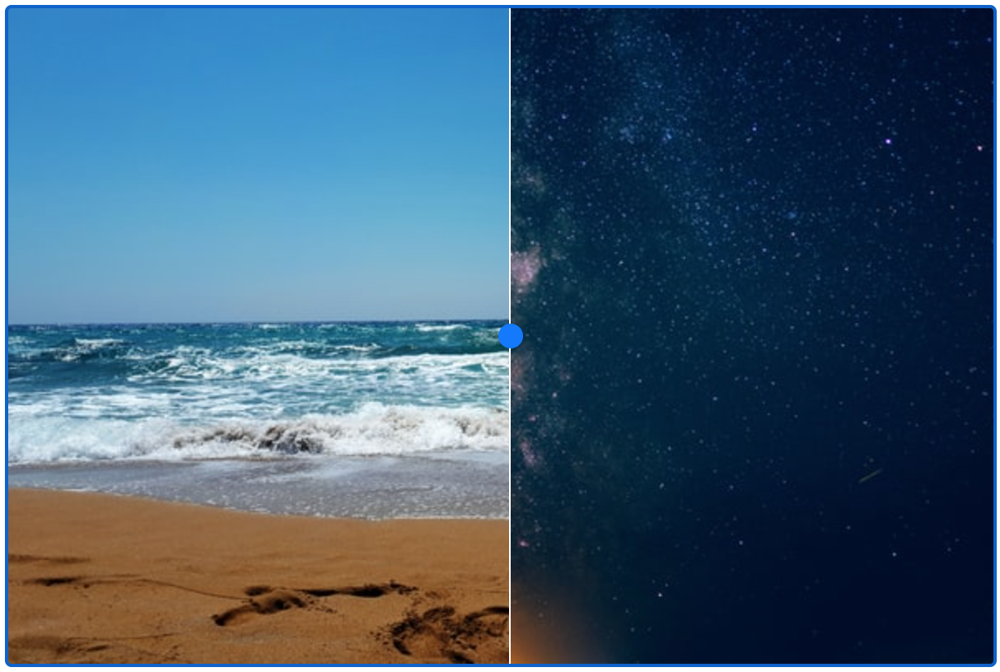

# Split View

Split View is a web component for comparing two images. To use it include `/dist/split-view.js` in a page and then use `<split-view>[...]</split-view>` to use the component. It's best used with `<picture>` elements.



## Goals

The aim of `<split-view>` is provide an accessible image comparison component. Under the hood `<split-view>` uses an  HTML range input to control the position of the slider rather than a JavaScript powered `div` element which is more commonly used for this sort of input element. Using an HTML input means all of the accessibility features of the browser are still usable.

## Usage

Give the two elements to be compared attributes of `slot="top"` and `slot="bottom"`.

```
<split-view>
  <picture slot="top">
    
  </picture>
  <picture slot="bottom">
    
  </picture>
</split-view>
```

Split View also supports an optional `mode` and `start` parameters. `mode` determines how the top and bottom layers are blended. `start` defines the start point for the comparison line (in percent).

```
<split-view mode="screen" start=25>
  <picture slot="top">
    
  </picture>
  <picture slot="bottom">
    
  </picture>
</split-view>
```

Options are the same as CSS's `mix-blend-mode`.

## Accessibility

### Accessibility labels

`<split-view>` accepts two labels that are used for accessibilty;

- `split-view-label` - An aria-label value for the component
- `slider-label` - A label used to describe the slider

### Focus outline

By default split-view will have a focus outline if the user has focused on it. This is desirable and good practice for making accessible websites, but if you really have to switch it off you can by defining a style in your page of;

```css
split-view {
  --outline: none;
}
```
